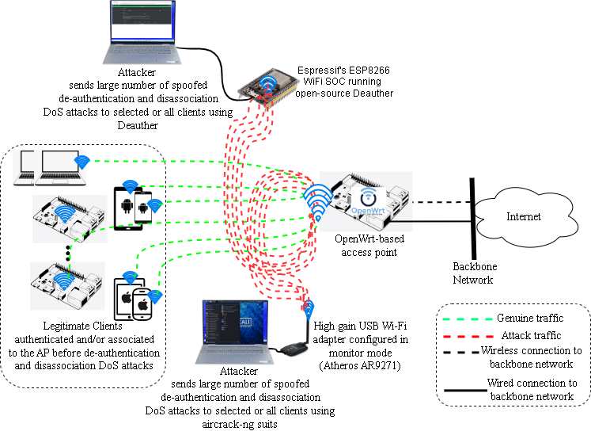
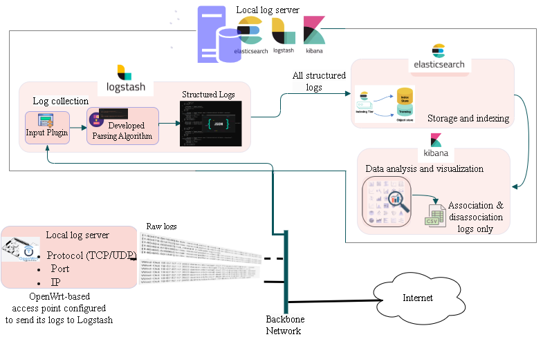
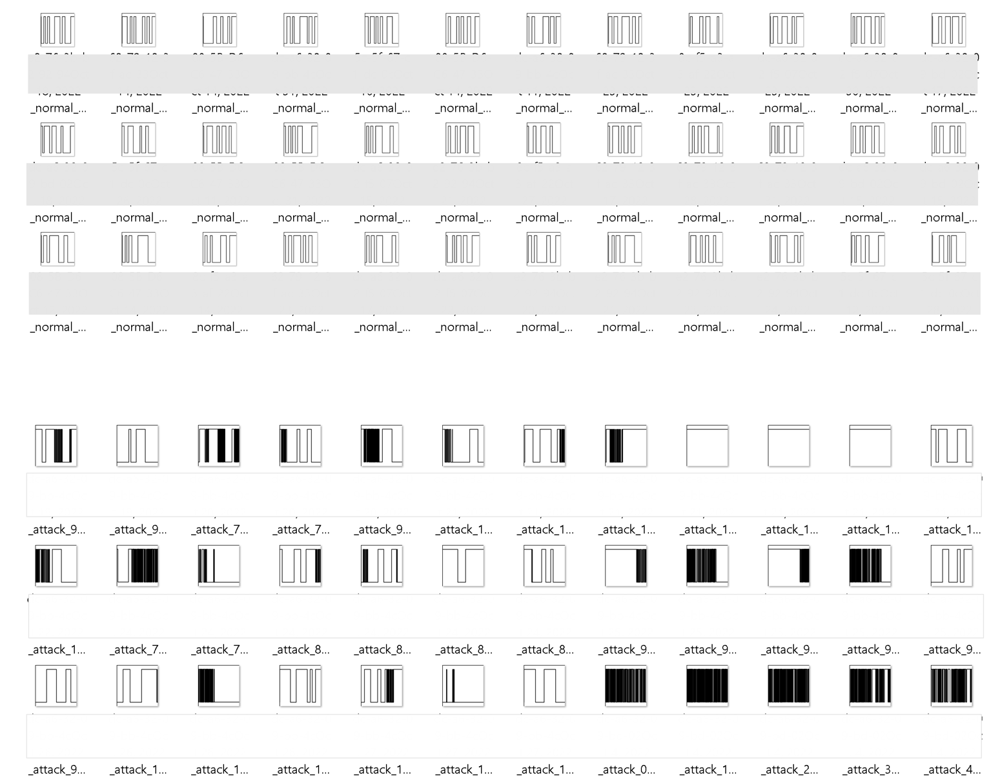

# Wi-Fi Association_Disassociation Dataset

This project aims to generate a real-time dataset for intrusion detection systems (IDS) in IEEE 802.11 (Wi-Fi) environments, with the main focus on de-authentication and disassociation attacks detection. 
This dataset is part of the main goal of our research, which aims to propose a novel IDS for de-authentication and disassociation attack detection and advance the development of IDSs in all real-world Wi-Fi network infrastructures. To accomplish this, de-authentication and disassociation attacks are executed on a Wi-Fi testbed consisting of 16 devices.

The following illustrates the main objectives of the Wi-Fi De-authentication_Disassociation dataset project:

- building new realistic testbed for de-authentication and disassociation attack datasets 
- generating normal Wi-Fi traffic data using real user devices and launching attacks using two different tools (Kali Linux and Deauther)
- building an automated process that collects, parses, visualizes and analyzes the the network traffic data built on top of Elastic Stack (Elasticsearch, Logstash, and Kibana)
- producing a structured dataset that can be used for further steps in machine/deep learning-based IDS development
- futher preprocessing this dataset and using it in our IDS development called "Transfer and CNN-Based IDS for De-authentication (Disassociation) DoS Attack Detection";

This Wi-Fi De-authentication_Disassociation dataset project and activities around it can be summarized in the following steps:

## Testbed Setup ##
Our testbed setup was configured as follows:
- 16 client devices, which consist of smartphones, tablets, laptops, desktops, and raspberry PIs
- access point, which is configured using OPenWrt
- attackers: two different machines are used:
  - attacker1 is configured on a 64-bit Windows 11 machine where a NodeMCU device loaded with deauther tool is connected to
  - attacker2 is configured on Kali Linux virtual machine hosted on a 64-bit Windows 11 machine along with a wireless adaptor (Atheros AR9271) plugged into the network interface  of the host machine
- another  64-bit Windows machine hosts ELK and collects traffic from the access point, parses, stores, analyzes and generates a structured dataset 

The testbed setup can be represented by the following two logical topologies:

The above topoloy shows the logical setup of the client devices for normal traffic, the two attackers carried out from the Kali Linux machine and NodeMCU Deauther tool configured machine, and the OpenWrt-based access point. 
The topoloy below shows the setup for attack and normal traffic collection from the access point, parsing the unstructured traffic data through logstash and the developed parsing algorithm, storing at Elasticsearch, analysis and visualization of the structured data by Kibana, and finally generating the dataset, which is ready for further machine learning pre-processing.

 

## Dataset ##
As stated above, we collected the Wi-Fi network traffic of the clinet devices and attackers coming through the OpenWrt-based access and configured it to go to the local server and get parsed by the parsing algorithm we developed on top of Logstash. The approach we followed to generate the traffic and launch the attacks was as follows:
- To generate the normal wi-fi traffic, we configured the clinets to associate and disassociate mostly in 1 minute, but we have included varieties like 5 minutes and above
- To generate attack i-fi traffic, we launched the attacks for various time durations, like 5 minutes or less, 10 minutes, 30 minutes, 1 hour, and even the whole day.
- In both these configurations for normal and attack, we included random time durations to show the diversified nature of associations and disassociations of clients with the access point during normal as well as attack conditions.
With this setup and dataset, we aimed to focus on a few features of the dataset: timestamp, mac address of devices, association-disassociation, and the data type (label).
- timestamp: The date and time at which the traffic data is logged by the AP
- mac_address: the unique identifier for each device in the testbed
- association-disassociation:
   - “Associated” when client device is associated/connected
   - “disassociated” when client device is disassociated/disconnected
- dataType(label):
   - “normal” when benign/legitimate network traffic flow
   - “attack” when illegitimate/malicious network traffic flow
The composition of attack and normal Wi-Fi network traffic samples we generated in our testbed is shown in the table below.

| Data Type (Label) | Number of Samples | Description |
| --------------- | ---------------- | ---------- |
| Attack |376,430   | •	Carried out October 4-27, 2022   •	Continuous attack Wi-Fi traffic data was carried out at different tune durations including variable time from 5 to 30 minutes, hours, and whole day |
| Normal | 233,130  | •	Carried out October 11-31, 2022 |
|        |          | • Generating continuous normal Wi-Fi traffic data was car-ried out at different variable time where some are for 1  to 30 minutes while others are hours to whole day |
| Total Samples | 609,560 |

Once the dataset is processed through this algorithm, the normal and attack images generated looks like below.

## Use Case ##
After generating the dataset, we developed an IDS solution based on transfer learning (TL) and convolutional neural networks (CNN) to detect de-authentication and disassociation attacks that can be applied to any wi-fi network infrastructure. To prepare the dataset and suite it to the TL and CNN-based IDS, we further went through a number of preprocessing stages.  
After performing a basic cleaning of the dataset, we passed it through our novel algorithm, which, in its minimum function:
- generates a day from the timestamp, calculates the total time duration that each device associates and disassociates per day,
-  sets window size (5 minutes or 10 minutes),
-  plots a figure per window size by converting association to be an upper limit (digital high or 1) and disassociation to be a lower limit (digital low or 0), and
-  saves each image with its own file name.
-  it also performs other tasks such as sorting, conversion to minutes, figure formatting, etc.

The TL and CNN-based IDS solution we developed was then trained and evaluated with the generated images of the dataset in detecting de-authentication and disassociation attacks.

## Contributing ##
Currently, this dataset project is not under development, but we are working to make our IDS solution publicly available to show the results of using this dataset in the use case. However, any contribution is welcome. Please contact one of the authors of the paper.

## Acknowledgments ##
The authors would like to thank the British Telecom Ireland Innovation Center (BTIIC) for their financial and educational support in conducting this research.

## Citation ##
> Samson Kahsay Gebresilassie, Joseph Rafferty, Liming (Luke) Chen, Zhan Cui, and Mamun Abu-Tair "Transfer and CNN-Based De-authentication (Disassociation) DoS Attack Detection in IoT Wi-Fi Networks"
> Submitted to: MDPI electronics Special Issue: Communication, Sensing and Computing for Intelligent Internet of Things Enabled Applications

